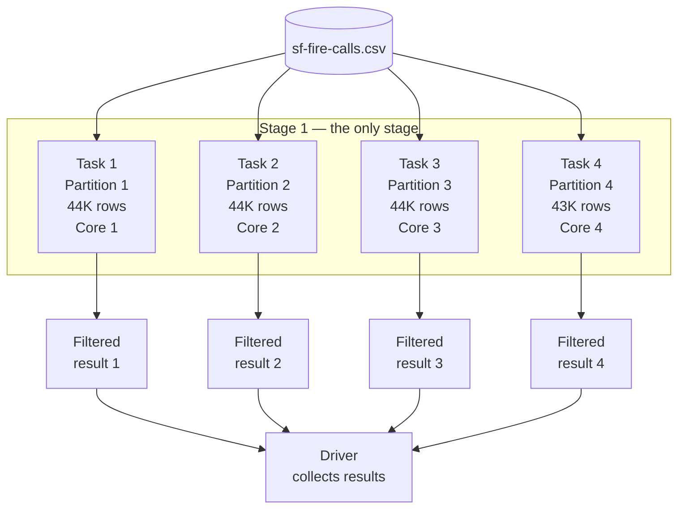
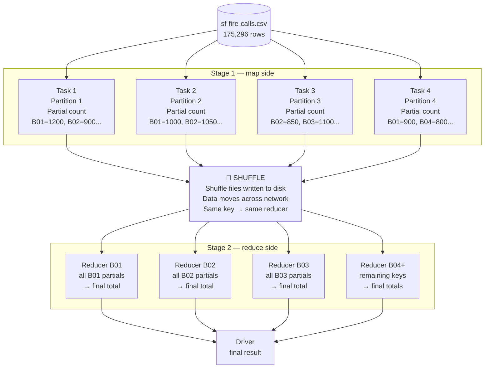
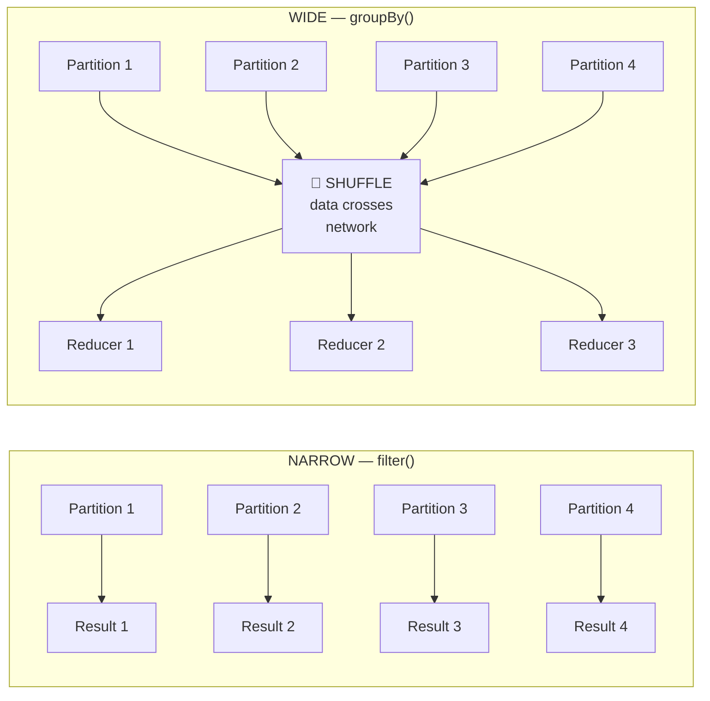
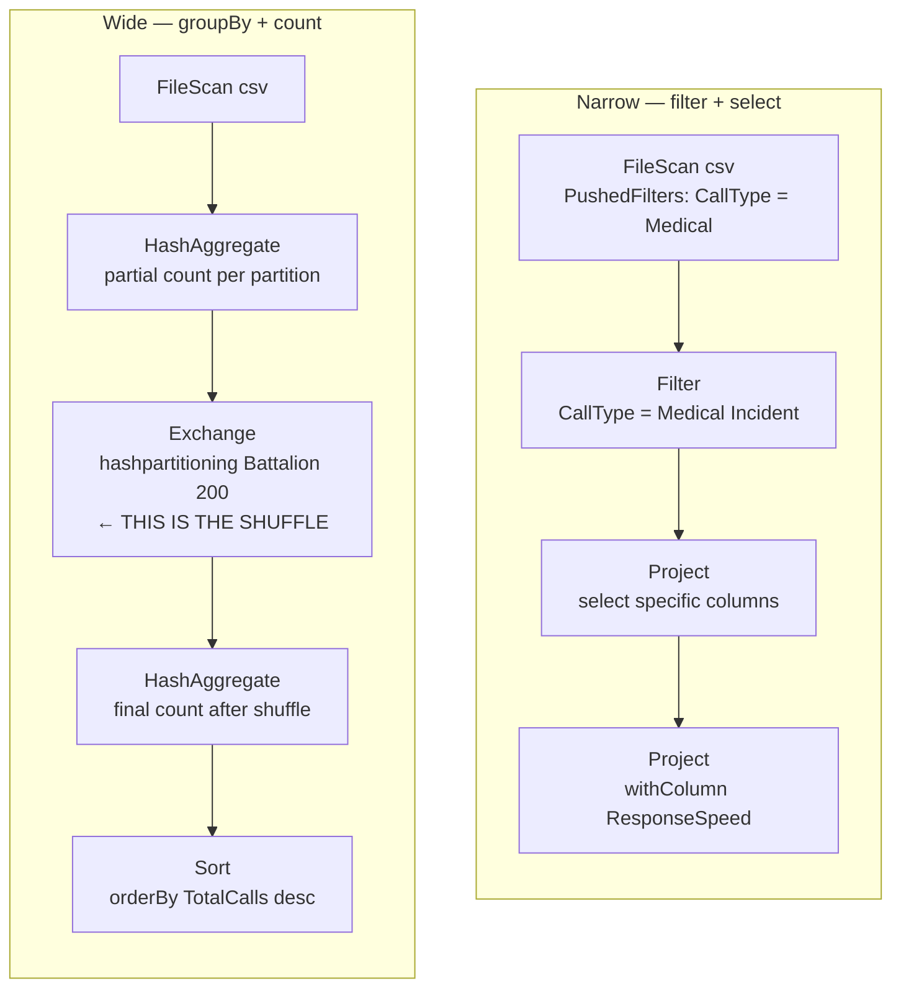
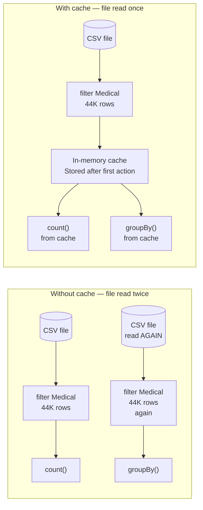
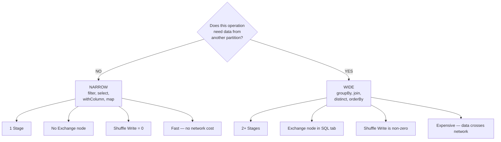

# Shuffle, Stages and Partitions in Apache Spark

**Beacon Solutions, Inc.**

---

## The Single Most Important Rule

Not all Spark operations cost the same. Some are free — data never moves. Some are expensive — data crosses the network. Understanding this difference is the key to writing fast Spark code and reading the Spark UI correctly.

---

## How Your Data Is Laid Out

When Spark reads a file, it splits it into **partitions** — equal chunks of rows distributed across your executor cores. With `local[4]`, you get 4 partitions and 4 cores. Each core processes exactly one partition at a time.

```
175,296 rows in sf-fire-calls.csv
        ↓
┌───────────────┬───────────────┬───────────────┬───────────────┐
│  Partition 1  │  Partition 2  │  Partition 3  │  Partition 4  │
│  ~44,000 rows │  ~44,000 rows │  ~44,000 rows │  ~43,296 rows │
│    Core 1     │    Core 2     │    Core 3     │    Core 4     │
└───────────────┴───────────────┴───────────────┴───────────────┘
```

The question every Spark operation must answer is: **can I do my job by looking only at my own partition, or do I need to see rows from other partitions?**

That question is the entire difference between narrow and wide transformations.

---

## Part 1 — Narrow Transformations (No Shuffle)

### What they are

`filter()`, `select()`, `withColumn()`, `map()`, `where()`

Each row can be processed completely independently. Partition 1 never needs to know what is in Partition 2. Every core works on its own data in parallel, finishes, and returns the result.

### What happens inside Spark — step by step

```
You write:  fireDF.filter(col("CallType").equalTo("Medical Incident"))
```

```
Step 1 ── filter() is called
          Nothing runs.
          Spark adds this to the DAG (the recipe, not the cooking).
          
Step 2 ── You call .count() or .show()
          THIS triggers execution.
          Spark creates a JOB for this action.
          
Step 3 ── Spark analyses the DAG
          "Does any operation need data from another partition?"
          filter() answer: NO.
          Partition 1 can filter its own 44K rows independently.
          Partition 2 can filter its own 44K rows independently.
          Spark groups everything into ONE STAGE.
          
Step 4 ── Spark launches 4 Tasks simultaneously
          Task 1 → reads Partition 1 → checks each row → keeps matches
          Task 2 → reads Partition 2 → checks each row → keeps matches
          Task 3 → reads Partition 3 → checks each row → keeps matches
          Task 4 → reads Partition 4 → checks each row → keeps matches
          All 4 run IN PARALLEL. No waiting. No coordination.
          
Step 5 ── Each task finishes independently
          Results collected by the driver.
          Zero data moved between partitions.
          Zero bytes written to disk for shuffle.
          Zero network transfer.
```

### Diagram — Narrow Transformation



### What you see in Spark UI

| Location | What you see |
|---|---|
| Jobs tab | 1 Job |
| Stages tab | **1 Stage** inside that job |
| Tasks | 4 tasks, all similar duration |
| SQL tab | **No Exchange node** in the physical plan |
| Shuffle Write | **0 bytes** |
| Shuffle Read | **0 bytes** |

> **Open Spark UI → SQL tab → click the query → read the plan bottom-up.**
> You will see: `FileScan csv → Filter → Project`
> No Exchange node anywhere. That confirms no shuffle happened.

---

## Part 2 — Wide Transformations (Shuffle)

### What they are

`groupBy()`, `join()`, `distinct()`, `orderBy()`, `repartition()`

These operations need to bring rows with the same key together from across all partitions. The problem: Battalion B02 rows are spread across all 4 partitions. To count ALL of them, one task must see ALL of them. That means data has to physically move.

### What happens inside Spark — step by step

```
You write:  fireDF.groupBy("Battalion").agg(count("*"))
```

```
Step 1 ── groupBy() is called
          Nothing runs. DAG is updated.

Step 2 ── You call .show()
          Spark creates a JOB.
          Spark analyses the DAG.
          "Does any operation need data from another partition?"
          groupBy() answer: YES.
          B02 rows are in Partitions 1, 2, 3 and 4.
          ALL of them must reach ONE reducer to be counted.
          Spark creates 2 STAGES with a shuffle between them.

━━━━━━━━━━━━━━━━━━━━━━━━━━━━━
STAGE 1 BEGINS
━━━━━━━━━━━━━━━━━━━━━━━━━━━━━

Step 3 ── Spark launches 4 Tasks (one per partition)
          Task 1 reads Partition 1 from the CSV file.
          Task 2 reads Partition 2 from the CSV file.
          Task 3 reads Partition 3 from the CSV file.
          Task 4 reads Partition 4 from the CSV file.
          All 4 run in parallel.

Step 4 ── Each task does a PARTIAL aggregation locally
          This is called the "map-side" or "pre-shuffle" aggregation.
          Task 1 computes its own local counts:
            B01=1200, B02=900, B03=1100 (from Partition 1 only)
          Task 2 computes its own local counts:
            B01=1000, B02=1050, B04=800 (from Partition 2 only)
          These are NOT the final answers — just partial totals.

Step 5 ── Each task HASHES the keys to decide where to send them
          hash("B01") % 200 = Reducer slot 45
          hash("B02") % 200 = Reducer slot 12
          hash("B03") % 200 = Reducer slot 78
          Every task that has a B01 row will hash it to slot 45.
          This guarantees: same key → same reducer → correct count.

Step 6 ── Each task WRITES its partial results to local disk
          These files are called SHUFFLE FILES (or spill files).
          This disk write is what appears in the SHUFFLE WRITE column.
          Stage 1 ends here.

━━━━━━━━━━━━━━━━━━━━━━━━━━━━━
THE SHUFFLE (between stages)
━━━━━━━━━━━━━━━━━━━━━━━━━━━━━

Step 7 ── Data moves across the network
          All B01 partial totals from all 4 tasks travel to Reducer 45.
          All B02 partial totals from all 4 tasks travel to Reducer 12.
          All B03 partial totals from all 4 tasks travel to Reducer 78.
          This is pure network transfer.
          It is the most expensive thing Spark does.

━━━━━━━━━━━━━━━━━━━━━━━━━━━━━
STAGE 2 BEGINS
━━━━━━━━━━━━━━━━━━━━━━━━━━━━━

Step 8 ── New tasks read their shuffle input from disk
          This read appears in the SHUFFLE READ column.
          Reducer 45 now has ALL partial B01 counts from all 4 partitions.

Step 9 ── Final aggregation
          B01: 1200 + 1000 + 900 + ... = final correct total.
          B02: 900 + 1050 + ... = final correct total.
          Now the answer is correct — every row was counted.

Step 10 ── Results returned to driver. Job complete.
```

### Diagram — Wide Transformation (groupBy)



### What you see in Spark UI

| Location | What you see |
|---|---|
| Jobs tab | 1 Job |
| Stages tab | **2 Stages** inside that job |
| Stage 1 | Shuffle Write column is **non-zero** |
| Stage 2 | Shuffle Read column is **non-zero** |
| SQL tab | **Exchange node** between two HashAggregate nodes |
| Tasks in Stage 1 | 4 tasks (one per input partition) |
| Tasks in Stage 2 | Up to 200 tasks (default shuffle.partitions) |

> **Open Spark UI → SQL tab → click the groupBy query → read the plan bottom-up.**
> You will see: `FileScan → HashAggregate → Exchange → HashAggregate`
> That Exchange node IS the shuffle. Click it — it will show `hashpartitioning(Battalion, 200)`
> meaning: Spark hashed every Battalion value into one of 200 reducer slots.

---

## Part 3 — Side by Side



---

## Part 4 — The Physical Plan in Spark UI

Every time you run a query, Spark UI's SQL tab shows the **physical plan** — the exact steps Spark took. Read it **bottom up**.



**What each node means:**

| Node in SQL tab | What it means |
|---|---|
| `FileScan csv` | Reading the file from disk |
| `Filter` | Your `filter()` or `WHERE` condition |
| `Project` | Your `select()` or `withColumn()` |
| `HashAggregate` | Your `groupBy().agg()` — appears twice when there is a shuffle |
| `Exchange` | **The shuffle** — data moving between partitions |
| `Sort` | Your `orderBy()` |
| `BroadcastHashJoin` | A join where the small table was broadcast — no shuffle |
| `SortMergeJoin` | A join where both sides were shuffled and sorted |
| `AQEShuffleRead` | AQE coalesced empty shuffle partitions automatically |

---

## Part 5 — Caching: Stop Recomputing the Same Data

Without caching, every action re-reads the file and re-applies every transformation from scratch. If you use the same filtered DataFrame twice, the file is read twice.



```java
// Mark for caching — still lazy, nothing stored yet
medicalDF.cache();

// First action: reads file, computes, stores in cache
medicalDF.count();

// Second action: reads from cache — file NOT read again
medicalDF.groupBy("Neighborhood").agg(count("*")).show();

// Release when done
medicalDF.unpersist();
```

**In Spark UI — Storage tab:** After the first action, the cached DataFrame appears with its size in memory and the fraction cached. The second query's physical plan shows `InMemoryTableScan` instead of `FileScan csv` at the bottom — that confirms it read from cache, not from disk.

---

## Summary



### How to reduce shuffle cost

1. **Filter early** — reduce the number of rows before the shuffle so less data crosses the network
2. **Select early** — drop unused columns before the shuffle so each row is smaller
3. **Cache** DataFrames that are used more than once — avoids re-reading and re-computing
4. **Broadcast small tables** in joins — eliminates the shuffle entirely for the small side
5. **Trust AQE** — it coalesces empty shuffle partitions automatically in Spark 3.5.x

### The one-line rule

> **Every Exchange node in the SQL tab costs you a network transfer. Count them. Minimize them.**

---

*Beacon Solutions, Inc. — Apache Spark Training*